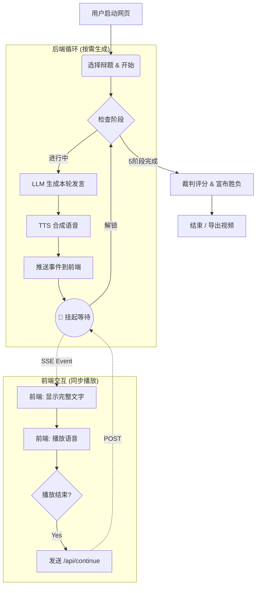

# 🎭 AI 辩论赛

> 💡 **技术解密**: 关于本项目的详细技术实现、架构设计及踩坑记录，请参阅 [👉 WHAT_WE_LEARN.md](WHAT_WE_LEARN.md)。

---

## 🏎️ 极速运行

### 1. 设置环境变量
运行前在终端中设置 API Key（替换为你自己的密钥）：
```bash
set QWEN_API_KEY=sk-你的通义千问密钥
set DOUBAO_API_KEY=你的豆包密钥
set KIMI_API_KEY=sk-你的Kimi密钥
set DEEPSEEK_API_KEY=sk-你的DeepSeek密钥
```

### 2. 启动
```bash
# 安装依赖
pip install -r requirements.txt

# 启动服务
python app.py
```

### 3. 体验
浏览器访问 **http://localhost:5000** 即可开始。

---

## 🔄 标准赛制流程

```
开篇立论        正一(立论) ──→ 反一(立论)
   │
攻辩质询        正二问反一 → 反二问正一 → 正一问反二 → 反一问正二
   │
攻辩小结        正一(小结) ──→ 反一(小结)
   │
自由辩论        正反交替发言 × 6轮
   │
总结陈词        反二(总结) ──→ 正二(总结)
   │
裁判点评        AI裁判评分 ──→ 宣布胜负
```

## 🔄 系统运行流程



---

## 📄 许可证
MIT License
