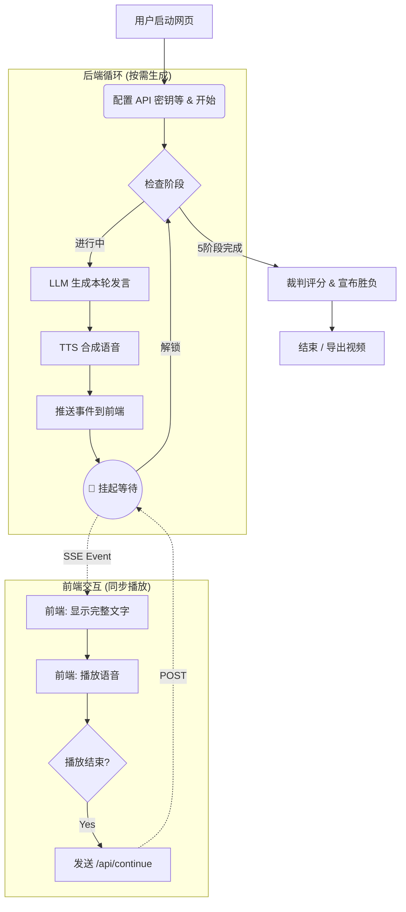

# 🎭 AI 辩论赛

> 💡 **技术解密**: 关于本项目的详细技术实现、架构设计及踩坑记录，请参阅 [👉 WHAT_WE_LEARN.md](WHAT_WE_LEARN.md)。

---

## 🚀 一键启动（推荐）

双击 **`启动.bat`**，脚本会自动安装依赖、启动服务、打开浏览器，一步完成。

---

## 🔧 手动运行

### 1. 设置环境变量（可选，也可在网页中直接填写）
```bash
set QWEN_API_KEY=sk-你的通义千问密钥
set DOUBAO_API_KEY=你的豆包密钥
set KIMI_API_KEY=sk-你的Kimi密钥
set DEEPSEEK_API_KEY=sk-你的DeepSeek密钥
```

### 2. 启动
```bash
# 安装依赖
pip install -r requirements.txt

# 启动服务
python app.py
```

### 3. 体验
浏览器访问 **http://localhost:5000** 即可开始。

---

## ⚙️ 网页内配置

打开网页后，点击 **"⚙️ 高级配置"** 展开配置面板，无需修改任何代码即可：

| 配置项 | 说明 |
|--------|------|
| **API 密钥** | 为每个 LLM 服务商（通义千问、豆包、Kimi、DeepSeek）输入 API Key，自动保存到浏览器本地（不会上传） |
| **LLM 服务商** | 每位辩手可独立切换使用哪个 LLM 服务商 |
| **自定义模型** | 每位辩手可填写具体模型名（留空则使用服务商默认模型） |
| **音色** | 每位辩手可从 8 种中文 TTS 音色中自由选择 |
| **人设描述** | 每位辩手的性格、辩论风格、标志性口头禅，完全可编辑 |
| **发言字数** | 单次发言字数上限（50~800，默认 200） |
| **自由辩论轮数** | 自由辩论阶段轮数（2~12，默认 6） |
| **时间上限** | 辩论总时长上限（分钟，0 = 不限，默认 5） |

---

## 🔄 标准赛制流程

```
开篇立论        正一(立论) ──→ 反一(立论)
   │
攻辩质询        正二问反一 → 反二问正一 → 正一问反二 → 反一问正二
   │
攻辩小结        正一(小结) ──→ 反一(小结)
   │
自由辩论        正反交替发言 × 6轮
   │
总结陈词        反二(总结) ──→ 正二(总结)
   │
裁判点评        AI裁判评分 ──→ 宣布胜负
```

## 🔄 系统运行流程


```mermaid
graph TD
    A[用户启动网页] --> B(配置 API 密钥等 & 开始);

    subgraph "后端循环 (按需生成)"
        B --> C{检查阶段};
        C -- 进行中 --> D[LLM 生成本轮发言];
        D --> E[TTS 合成语音];
        E --> F[推送事件到前端];
        F --> G((🛑 挂起等待));
    end

    subgraph "前端交互 (同步播放)"
        G -. SSE Event .-> H[前端: 显示完整文字];
        H --> I[前端: 播放语音];
        I --> J{播放结束?};
        J -- Yes --> K[发送 /api/continue];
        K -. POST .-> G;
        G -- 解锁 --> C;
    end

    C -- 5阶段完成 --> L[裁判评分 & 宣布胜负];
    L --> M[结束 / 导出视频];
```

---

## 🧑‍🎤 默认辩手阵容

| 辩手 | 立场 | 角色 | LLM | 风格 |
|------|------|------|-----|------|
| 千问·论道 | 正方 | 一辩 | 通义千问 | 立论型，类黄执中 |
| 豆包·善辩 | 正方 | 二辩 | 豆包 | 攻辩型，类陈铭 |
| Kimi·锐评 | 反方 | 一辩 | Kimi | 反驳型，类马薇薇 |
| 深思·明辨 | 反方 | 二辩 | DeepSeek | 思辨型，类庞颖 |

---

## 🐋 Docker 运行

```bash
# 在 docker/docker-compose.yml 中填写 API Key 环境变量，然后：
docker-compose -f docker/docker-compose.yml up --build
```

---

## 📦 依赖说明

| 依赖 | 说明 |
|------|------|
| flask | Web 服务框架 |
| openai | OpenAI 兼容接口客户端 |
| edge-tts | 微软 Edge TTS 语音合成 |
| Pillow | 视频卡片图片生成 |
| FFmpeg | 视频合成和音频处理（需单独安装） |

**FFmpeg 安装**：[https://ffmpeg.org/download.html](https://ffmpeg.org/download.html)（安装后添加到 PATH）

---

## 📄 许可证
MIT License
