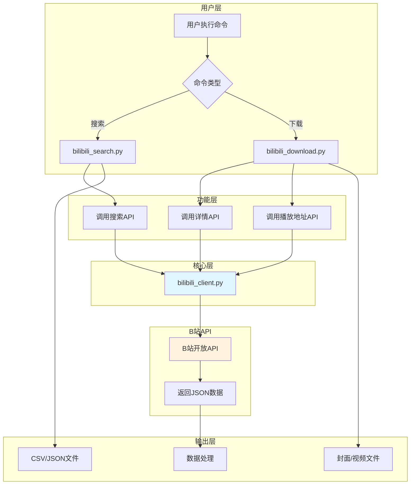
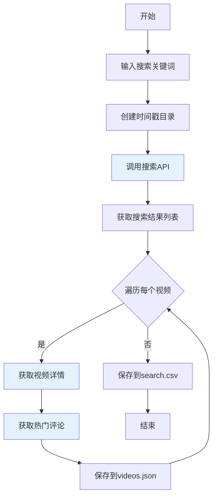
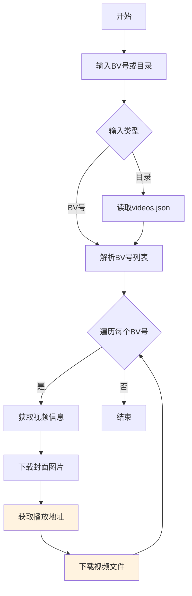

# B站（哔哩哔哩）爬虫项目文档

## 一、项目概述

该项目是一套针对B站（哔哩哔哩）视频平台的**数据采集工具**，通过调用B站官方开放API实现视频搜索、信息获取、评论抓取和视频文件下载功能。整个项目采用模块化设计，分为API封装层、搜索层和下载层三个部分。

### 1.1 项目定位

本项目的定位是一个轻量级的B站数据采集工具，适用于以下场景：视频内容研究、UP主数据分析、热门视频趋势分析、视频统计数据采集等。需要强调的是，本工具仅供学习和研究使用，请勿用于商业目的或大规模采集，以免对B站服务器造成压力。

### 1.2 技术架构

项目采用分层架构设计，从底层到顶层依次为：底层是`bilibili_client.py`，封装了所有与B站API的交互逻辑，包括请求发送、数据解析、错误处理和反封策略；中间层是`bilibili_search.py`，提供搜索功能调用底层API并将结果结构化存储；顶层是`bilibili_download.py`，提供视频下载功能，支持批量下载和目录批量处理。

---

## 二、文件结构

```
E:\integrity\7爬虫\
├── bilibili_client.py      # 【核心】API封装模块（7.9KB，209行）
├── bilibili_search.py      # 【功能】搜索脚本（2.8KB，104行）
├── bilibili_download.py    # 【功能】下载脚本（3.7KB，134行）
└── data/                  # 数据输出目录
    ├── downloads/          # 下载的视频存放目录
    └── [时间戳_关键词]/   # 每次搜索创建的独立目录
        ├── search.csv     # 搜索结果表格
        ├── videos.json    # 视频详细信息+评论
        └── media/         # 下载的封面和视频文件
```

### 2.1 各文件职责

**bilibili_client.py** 是整个项目的核心模块，负责任务最重：维护Session和Cookie管理；实现所有B站API调用方法；提供随机延迟和UA轮换等反封策略；处理请求重试和异常捕获。

**bilibili_search.py** 是搜索功能入口：接收命令行关键词参数；调用搜索API获取结果；获取每个视频的详细信息和评论；将结果保存为CSV和JSON格式。

**bilibili_download.py** 是下载功能入口：支持BV号直接下载和目录批量下载；下载视频封面图片；调用播放地址API获取真实视频URL并下载。

---

## 三、功能说明

### 3.1 核心功能列表

| 功能模块 | 功能描述 | 实现文件 |
|----------|----------|----------|
| 视频搜索 | 根据关键词搜索B站视频 | bilibili_search.py |
| 详情获取 | 获取视频完整信息（标题、描述、统计数据等） | bilibili_client.py |
| 评论抓取 | 获取视频热门评论内容 | bilibili_client.py |
| 热门视频 | 获取B站热门视频列表 | bilibili_client.py |
| 封面下载 | 下载视频封面图片 | bilibili_download.py |
| 视频下载 | 下载视频文件（支持多P） | bilibili_download.py |

### 3.2 数据采集能力

**搜索功能**可以获取以下信息：视频标题（带关键词高亮处理）、BV号（视频唯一标识）、UP主名称、播放量、时长、简介摘要。搜索结果默认返回10条，可通过参数调整每页数量。

**详情获取**可以获取以下完整信息：标题、BV号、AV号、CID（章节ID）、作者名称、视频描述、视频时长、各类统计数据（播放量、点赞数、投币数、收藏数、弹幕数、评论数）、发布时间、封面URL、标签数组。

**评论抓取**可以获取以下信息：评论用户昵称、评论内容文本、点赞数、评论时间戳。支持获取热门评论和最新评论两种模式。

### 3.3 反封策略

为了保证API调用的稳定性，项目实现了以下反封禁策略：

**随机延迟机制**：每次API请求之间随机等待1-3秒，模拟人类正常操作节奏，避免请求频率过高触发B站风控系统。这个延迟是累积的，单次运行请求越多，总等待时间越长。

**User-Agent轮换**：维护一个包含5种主流浏览器UA的列表，每10次请求随机切换一次，使请求看起来来自不同的浏览器客户端。

**匿名Cookie获取**：启动时自动访问B站首页，获取buvid3等必要的Cookie参数，保持Session的有效性，这是B站API调用的前置条件。

**请求限速保护**：单次运行最多60次API请求，超过这个数量会主动抛出异常停止运行。这个限制可以在代码中修改`MAX_REQUESTS_PER_RUN`常量来调整。

**文件大小过滤**：视频文件超过100MB时自动跳过，这个设计是为了避免下载超大视频文件导致磁盘空间浪费和下载超时。

---

## 四、使用方法

### 4.1 视频搜索

**基本用法**：

```bash
cd E:\integrity\7爬虫
python bilibili_search.py "Python教程"
```

执行后会进行以下操作：首先创建以`时间戳_关键词`命名的目录；然后调用搜索API获取10条视频结果；接着获取每个视频的详细信息和5条热门评论；最后保存search.csv和videos.json两个文件。

**输出示例**：

```
============================================================
B站搜索: Python教程
保存到:  E:\integrity\7爬虫\data\20260219_150000_Python教程
============================================================

[1] 搜索视频...
  1. 【Python教程】2024年，最适合入门的Python教程！
     UP: 程序员青戈  |  播放: 52.3w  |  BV: BV1H...
  2. Python零基础入门完整教程（全网最详细）
     UP: 鱼C-小甲鱼  |  播放: 128.7w  |  BV: BV1x...
  ...

[2] 获取视频详情和评论...
  [1/10] BV1H... Python教程... (3 comments)
  [2/10] BV1x... Python零基础... (5 comments)
  ...

[OK] Done. Results in: E:\...\data\20260219_150000_Python教程
```

### 4.2 视频下载

**根据BV号下载**：

```bash
python bilibili_download.py BV1Hxxx BV2xxx
```

这会下载指定BV号的视频封面和视频文件，保存到`data/downloads/`目录。

**根据搜索结果批量下载**：

```bash
python bilibili_download.py data/20260219_150000_Python教程/
```

这会读取指定目录下的`videos.json`文件，批量下载其中所有视频的封面和视频文件。

**下载输出结构**：

```
data/downloads/
├── BV1Hxxx.jpg    # 视频封面
├── BV1Hxxx.mp4    # 视频文件
├── BV2xxx.jpg
├── BV2xxx.mp4
└── ...
```

### 4.3 高级用法

**修改搜索数量**：编辑`bilibili_search.py`，找到`page_size=10`这一行，修改为期望的数值。

**修改评论数量**：编辑`bilibili_search.py`，找到`count=5`这一行，修改为期望的数值。

**修改视频质量**：编辑`bilibili_download.py`，找到`qn=32`，可用参数包括16（360p）、32（480p）、64（720p）、80（1080p）。

---

## 五、流程图

### 5.1 整体架构流程



### 5.2 搜索流程



### 5.3 下载流程



---

## 六、环境依赖

### 6.1 Python环境

```bash
# Python版本要求
Python 3.8 或更高版本

# 必需安装的库
pip install requests
```

### 6.2 网络要求

可以正常访问B站API（api.bilibili.com），建议使用稳定的网络环境。由于涉及API调用，需要保持网络连接稳定，避免频繁超时导致请求失败。

### 6.3 可选配置

无需额外配置，代码中已包含所有必要的默认配置，包括User-Agent池、API超时设置等。

---

## 七、输出数据格式

### 7.1 search.csv 格式

| 字段名 | 数据类型 | 说明 |
|--------|----------|------|
| title | 字符串 | 视频标题 |
| bvid | 字符串 | B站视频唯一标识（BV号） |
| author | 字符串 | UP主名称 |
| play | 整数 | 播放量 |
| duration | 字符串 | 视频时长（格式：MM:SS） |
| description | 字符串 | 视频简介（最多80字符） |

### 7.2 videos.json 格式

```json
{
  "title": "视频标题",
  "bvid": "BV1xxx",
  "aid": 12345678,
  "cid": 987654321,
  "author": "UP主名称",
  "description": "视频详细描述",
  "duration": 600,
  "view": 523000,
  "like": 15000,
  "coin": 8000,
  "favorite": 12000,
  "danmaku": 3000,
  "reply": 500,
  "pubdate": 1705123456,
  "pic": "https://i0.hdslb.com/...",
  "tags": ["Python", "教程", "编程"],
  "top_comments": [
    {
      "user": "用户名",
      "content": "评论内容",
      "like": 666,
      "time": 1705123456
    }
  ]
}
```

---

## 八、常见问题

### 8.1 请求超时

**问题表现**：程序运行过程中出现`ConnectionError`或`Timeout`错误。

**解决方法**：检查网络连接是否稳定；可以适当增加超时时间，编辑`bilibili_client.py`中的`timeout=15`参数；如果频繁超时，可能是B站API不稳定，建议稍后重试。

### 8.2 API返回错误

**问题表现**：程序输出`API error: code=-509`或类似错误信息。

**解决方法**：这通常是请求过于频繁导致的触发B站限流；程序会自动进行重试，等待一段时间后再次运行；可以增加请求之间的延迟时间，编辑`bilibili_client.py`中的`random.uniform(1.0, 3.0)`参数。

### 8.3 视频无法下载

**问题表现**：下载视频时提示获取播放地址失败。

**解决方法**：确认视频是否还在（部分视频会被删除）；检查BV号是否正确；某些版权视频或大会员专属视频可能无法获取播放地址。

### 8.4 文件名乱码

**问题表现**：保存的文件名显示为乱码。

**解决方法**：这是Windows系统编码问题，代码已包含UTF-8编码处理；如果仍有问题，检查系统区域设置是否支持中文。

---

## 九、代码结构详解

### 9.1 BilibiliClient 类方法

```python
class BilibiliClient:
    # 搜索相关
    def search_video(self, keyword, page=1, page_size=10)
        # 参数：keyword-搜索关键词，page-页码，page_size-每页数量
        # 返回：视频信息列表
    
    # 详情相关
    def get_video_info(self, bvid)
        # 参数：bvid-BV号
        # 返回：视频详细信息字典
    
    # 评论相关
    def get_comments(self, aid, page=1, count=10)
        # 参数：aid-AV号，page-评论页码，count-评论数量
        # 返回：评论列表
    
    # 热门相关
    def get_popular(self, page=1, page_size=10)
        # 参数：page-页码，page_size-每页数量
        # 返回：热门视频列表
    
    # 下载相关
    def get_play_url(self, bvid, cid, qn=32)
        # 参数：bvid-BV号，cid-章节ID，qn-视频质量
        # 返回：播放地址信息
    
    def download_file(self, url, save_path, max_mb=100)
        # 参数：url-文件URL，save_path-保存路径，max_mb-最大文件大小
        # 返回：保存的路径或None
```

### 9.2 内部方法

```python
    def _init_cookies(self)
        # 初始化Cookie，获取必要的buvid3等参数
    
    def _sleep(self)
        # 随机延迟1-3秒，模拟人类操作
    
    def _get(self, path, params=None, retries=2)
        # 通用GET请求方法，包含重试逻辑和错误处理
```

---

## 十、注意事项

### 10.1 使用限制

本工具仅供学习研究使用，请勿用于商业目的或大规模自动化采集。大规模采集可能对B站服务器造成压力，也可能违反B站的服务条款。采集的数据请勿二次传播或用于侵权用途。

### 10.2 性能考虑

单次运行最多60次API请求，这是为了保护账号安全而设置的限制。如果需要大量数据，建议分多次运行，每次间隔一定时间。视频下载是单线程顺序执行，大批量下载可能需要较长时间。

### 10.3 数据存储

搜索结果会保存在`data/`目录下以时间戳命名的文件夹中，建议定期清理不需要的数据。视频文件会保存在`data/downloads/`目录，请确保磁盘空间充足。

---

*文档版本：1.0*
*更新时间：2026-02-19*
